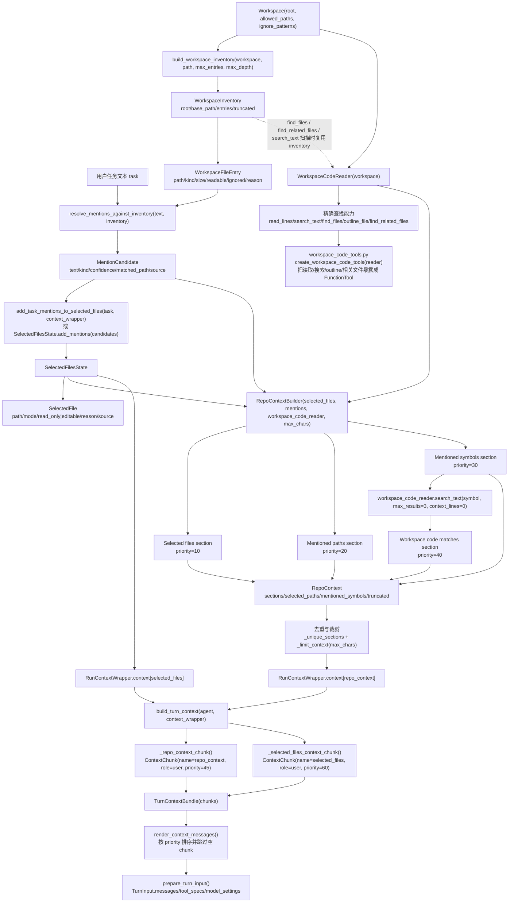

# PLAN - 仓库理解与上下文选择能力总教学计划

本文件是新对话、新 Agent 接手本阶段教学实现时的总入口。不要先翻聊天记录，也不要直接进入某个 `PLANxx.md` 开始写代码。先读完本文件，理解本阶段在整个 Coding Agent 升级路线里的位置，再按 `PLAN01.md` 到 `PLAN05.md` 的顺序推进。

本阶段对应此前升级路线中的“方案 A：仓库理解与上下文选择能力”。它不是最终 Coding Agent 的全部能力，而是把 `my_agent` 从“能调用工具的普通对话 Agent”推进到“能围绕一个本地代码仓库建立任务上下文的 Coding Agent 基础层”。

## 本阶段要解决什么

当前 `my_agent` 已经具备一些基础能力：有 `Workspace` 安全边界，有 workspace 读写与搜索工具，有 turn context 和 context chunk，有 coding agent profile，也有比较完整的测试基础。但是它还缺少 Coding Agent 最关键的第一层能力：在回答或修改代码前，先知道仓库里有什么、用户提到了什么文件、当前任务应该关注哪些文件、workspace code reader 能找到哪些相关代码、最后如何把这些信息稳定注入模型输入。

没有这一层能力，后续即使添加编辑器、patch、测试 runner、任务规划器，Agent 仍然会依赖临时搜索和模型猜测。那会导致文件选择不可审计、上下文不稳定、跨轮任务记忆断裂，也很难在测试中验证。

本阶段完成后，`my_agent` 应该形成一条清晰的数据链路：

用户任务文本进入 Agent 后，先由 workspace inventory 建立仓库观察层，再由 mention detector 识别路径、文件名、测试名和符号候选；这些候选结合 inventory 解析成真实仓库文件；selected files state 维护本轮任务关注文件；`WorkspaceCodeReader` 通过本地安全读写边界补充文件查找、文本命中、符号大纲和相关文件线索；`RepoContextBuilder` 将这些结果压缩成稳定的 `repo_context`；最后 `context_chunks.py` 和 `model_turn.py` 把 selected files 与 repo context 注入模型输入。

这条链路的核心不是“多塞上下文”，而是“让上下文来源可解释、可测试、可裁剪、可回滚”。

## 仓库上下文查找分析装置总流程图

下面的流程图只描述当前 `my_agent` 已经落地的主集成链路，忽略正则清洗、排序、字典转换等小型 helper。它的主线是：先收集仓库结构，再从用户文本中提取候选，再维护本轮关注文件，再用 workspace code reader 做精确查找，最后组装成 repo context 并进入 chunk 准备层。

### 主契约类和集成功能

| 层级 | 文件 | 基本契约类 | 主集成功能 | 信息如何被加工 |
| --- | --- | --- | --- | --- |
| 仓库观察层 | `workspace_inventory.py` | `WorkspaceInventory`、`WorkspaceFileEntry` | `build_workspace_inventory()` | 输入 `Workspace` 和扫描参数，经过 `Workspace.ensure_readable_path()`、allowed paths、ignore patterns 过滤后，输出稳定排序的仓库路径清单；每个 entry 只描述路径、类型、大小、可读性和忽略原因，不读取文件内容。 |
| 用户 text 查找层 | `context_mentions.py` | `MentionCandidate` | `detect_file_mentions()`、`resolve_mentions_against_inventory()` | 输入用户任务文本和 `WorkspaceInventory`；先识别 path、filename、test、symbol 候选，再用 inventory 的完整路径索引和 basename 索引解析真实文件，解析成功时写入 `matched_path` 并把 `source` 改成 `inventory`。 |
| 文件选中层 | `selected_files.py` | `SelectedFilesState`、`SelectedFile` | `add_task_mentions_to_selected_files()`、`SelectedFilesState.add_mentions()` | `add_task_mentions_to_selected_files()` 从 `RunContextWrapper` 取 `workspace` 和 `selected_files`，内部重新构建 inventory 并解析 mentions；`add_mentions()` 只把带 `matched_path` 的候选加入状态，形成带 mode、reason、source 的关注文件列表，`editable` 优先级高于 `read_only`。 |
| 精确查找目标层 | `workspace_code.py` | `WorkspaceCodeReader`、`CodeSearchMatch`、`FileOutlineSymbol`、`RelatedFileCandidate` | `read_lines()`、`search_text()`、`find_files()`、`outline_file()`、`find_related_files()` | 输入安全 workspace 和查询参数；所有路径先经过 `ensure_readable_path()`，文本搜索和文件查找会复用 inventory 控制扫描范围，输出行片段、文本命中、文件候选、Python 符号大纲或测试/源码相关文件候选。 |
| 工具暴露层 | `workspace_code_tools.py` | `FunctionTool` 列表 | `create_workspace_code_tools()` | 把 `WorkspaceCodeReader` 的读取、搜索、文件查找、outline、相关文件能力包装成模型可调用工具；它只转发参数和结果，不直接决定哪些信息进入 prompt。 |
| 上下文组装层 | `repo_context.py` | `RepoContextSection`、`RepoContext`、`RepoContextBuilder` | `RepoContextBuilder.build()` | 输入 selected files、mentions 和 workspace code reader；按 priority 生成 selected files、mentioned paths、mentioned symbols、workspace code matches 四类 section，再生成 `RepoContext`；初始化时去重重复 section，最后按 `max_chars` 保留高优先级 section 并设置 `truncated`。 |
| 运行态注入层 | `run_context.py` | `RunContextWrapper` | `repo_context`、`selected_files` property | 调用方把 `RepoContext` 放入 `context[CONTEXT_REPO_CONTEXT_KEY]`，把 `SelectedFilesState` 放入 `context[CONTEXT_SELECTED_FILES_KEY]`；wrapper 只做类型安全读取，类型不匹配返回 `None`。 |
| chunk 准备层 | `context_chunks.py`、`model_turn.py` | `ContextChunk`、`TurnContextBundle`、`TurnInput` | `build_turn_context()`、`_repo_context_chunk()`、`_selected_files_context_chunk()`、`prepare_turn_input()` | `build_turn_context()` 从 wrapper 读取 repo context 和 selected files，分别渲染成 `repo_context` 和 `selected_files` chunk；`render_context_messages()` 按 priority 输出消息并跳过空内容；`prepare_turn_input()` 最终生成模型本轮使用的 `messages`、`tool_specs` 和 `model_settings`。 |

### 信息加工主线

1. 信息收集：`Workspace` 定义安全边界，`build_workspace_inventory()` 在这个边界内生成 `WorkspaceInventory.entries`。
2. 信息识别：`resolve_mentions_against_inventory()` 把用户文本变成 `MentionCandidate`，其中路径类候选尽量解析成真实 `matched_path`，符号类候选保留为后续搜索关键词。
3. 信息分类：`SelectedFilesState` 将已解析文件变成 read-only 或 editable 的任务关注文件；未解析符号仍留在 mentions 中，不直接变成文件。
4. 精确查找：`WorkspaceCodeReader` 根据路径、文件名、符号或相关文件规则，在 workspace 安全边界内返回代码行、搜索命中、大纲和相关文件候选。
5. 上下文汇总：`RepoContextBuilder.build()` 把 selected files、mentioned paths、mentioned symbols、workspace code matches 合并成 `RepoContextSection`，再由 `RepoContext` 去重、排序和字符预算裁剪。
6. 模型输入注入：`RunContextWrapper.repo_context` 暴露 `RepoContext`，`_repo_context_chunk()` 把它变成 `ContextChunk(name="repo_context")`，`prepare_turn_input()` 最终把它放入 `TurnInput.messages`。

## 新 Agent 的阅读顺序

接手本阶段时，按下面顺序阅读，不要跳步：

1. 先读 `teach/PLAN.md`，明确本阶段目标、边界和模块依赖。
2. 再读 `teach/verification.md`，先知道最终要如何验收，避免课程实现偏离目标。
3. 然后按顺序读 `teach/PLAN01.md` 到 `teach/PLAN05.md`。每个计划都代表一个可独立完成、可测试、可回滚的小模块。
4. 每开始一个 PLAN，只阅读该 PLAN 里列出的 `my_agent` 文件和参考项目文件。不要一次性打开所有参考项目源码。
5. 实现前先补对应测试，再做最小代码改动。每节课新增业务代码尽量不超过 80 行，不含测试代码。
6. 完成一个 PLAN 后运行该 PLAN 的局部测试，再运行与上下文链路相关的回归测试。

如果上下文被压缩，新的 Agent 只需要重新读取本文件、当前未完成的 `PLANxx.md` 和 `verification.md`，就能恢复方向。

## 本阶段的 my_agent 基线

开始实现前，至少要理解这些已有文件的职责：

- `my_agent/src/agents/workspace.py` 是路径安全边界，负责 root、allowed paths、ignore patterns、路径解析和读写权限判断。
- `my_agent/src/agents/workspace_tools.py` 是面向模型的 workspace 工具层，已经有列文件、读文件、写文件、搜索文本等 handler。
- `my_agent/src/agents/context_chunks.py` 是上下文块渲染层，负责把系统说明、memory、summary 等信息变成模型输入片段。
- `my_agent/src/agents/model_turn.py` 是模型 turn 输入组装层，`prepare_turn_input()` 是验证 repo context 是否进入 prompt 的关键位置。
- `my_agent/src/agents/run_context.py` 是运行态上下文对象，后续 selected files 和 repo context 应该通过它或等价上下文对象进入 turn 构建流程。
- `my_agent/src/agents/coding_agent.py` 是 coding agent profile 的聚合入口，后续新增能力可以在这里接入，但不要把底层逻辑写进 profile 文件。

这几个文件代表了 `my_agent` 当前已经有的结构优势：安全边界、工具层、上下文层和 agent profile 已经分开。升级时要沿用这种分层，不要把所有逻辑塞进一个大类。

## 参考项目的使用方式

本阶段主要参考 `reference/openaiagent/` 的框架组织思想：能力应该以较清晰的组件、上下文、工具注册和运行态边界组织，而不是把所有功能耦合在一次模型调用里。

另外三个参考项目只补充 Coding Agent 能力，不作为结构复制对象：

- `reference/aider-main/` 主要参考 repo map、文件选择、chat chunks、只读/可编辑文件语义。
- `reference/OpenHands-main/` 主要参考 workspace 状态、会话隔离、运行态上下文和工具环境边界。
- 另一个参考项目以其 `PROJECT_ARCHITECTURE_ANALYSIS.md` 中描述的能力为准，只选择和“仓库理解、上下文选择、workspace code 查询”直接相关的部分。

阅读参考源码前，先读对应项目的 `PROJECT_ARCHITECTURE_ANALYSIS.md`。参考项目不是模板库，不要逐文件模仿；只抽取能力设计和边界划分。

## 五个 PLAN 的依赖关系

`PLAN01.md` 是根基，建立 `WorkspaceInventory`。没有它，后续 mention resolver、selected files、repo context 都只能靠字符串路径猜测。

`PLAN02.md` 在 inventory 之上建立 `context_mentions`。它从用户任务文本里提取路径、文件名、测试名和符号候选，并尝试解析到 inventory 中的真实文件。

`PLAN03.md` 建立 `SelectedFilesState`。它把“用户提到的文件”“系统自动选择的文件”“只读参考文件”“允许编辑文件”变成显式状态，为后续编辑器和 prompt 注入做准备。

`PLAN04.md` 建立 `WorkspaceCodeReader` 和相关工具。它让 `my_agent` 能在 `Workspace` 安全边界内读取代码行、搜索文本、查找文件、生成 Python 文件大纲和寻找相关测试/源码文件。

`PLAN05.md` 把前四步串成 `RepoContextBuilder`，并通过 context chunk 注入模型输入。这一步完成后，本阶段才算真正闭环。

不要调整这个实现顺序。PLAN04 看起来可以提前做，但没有 inventory、mentions 和 selected files 时，它只能成为孤立搜索工具，无法进入稳定 repo context。PLAN05 必须最后做，因为它依赖前四个模块的公共接口。

## 计划中的新增模块心智模型

本阶段新增模块应保持小而清晰：

`workspace_inventory.py` 只负责列出仓库结构和路径元数据。它不能读取文件内容，也不能决定任务相关性。

`context_mentions.py` 只负责从任务文本中提取候选和解析候选。它不能直接读文件，也不能修改 selected files。

`selected_files.py` 只负责维护文件选择状态。它不能执行文件编辑，也不能绕过 workspace 权限。

`workspace_code.py` 只负责在 workspace 安全边界内执行代码读取、文本搜索、文件查找、Python outline 和相关文件查找。它不能把查询结果直接写进 prompt。

`workspace_code_tools.py` 只负责把 `WorkspaceCodeReader` 包装成模型工具。它不能决定哪些查询结果进入 prompt。

`repo_context.py` 只负责把 inventory、mentions、selected files、workspace code matches 组织成可渲染上下文。它不能无限读文件，也不能进行代码修改。

`context_chunks.py` 只负责渲染 chunk。它不应该承担 mention 解析、workspace code 查询或 selected files 状态维护。

这种分工的目的，是让每个模块都能用 deterministic tests 验证，而不是依赖真实 LLM 行为。

## 课程实施规则

每个 `PLANxx.md` 里的课程是教学单元，不是一次性大改清单。教学时应按课程顺序推进：先讲为什么改，再写测试，再写少量实现，再运行验证。

每节课新增业务代码尽量控制在 80 行以内。如果某节课超过 80 行，优先拆成数据结构、解析逻辑、集成逻辑、测试补充四类小课。测试代码不计入 80 行限制，但测试也要保持聚焦。

每个 PLAN 的新增业务代码总量目标是 300 到 2000 行，不含测试和复用代码。少于 300 行时通常说明模块边界可能过窄或验收不足；超过 2000 行时通常说明一次纳入了过多能力，应该拆到后续阶段。

实现时优先复用现有 `Workspace`、tool registry、context chunk 和 tests 风格。不要为了模仿参考项目引入大型框架、复杂缓存、后台服务或异步扫描守护进程。

所有路径处理必须经过 `Workspace` 的安全策略。任何 inventory、mention resolve、repo context 文件访问都不能绕过 allowed paths 和 ignore patterns。

`WorkspaceCodeReader` 是轻量本地代码查询能力，不依赖外部索引服务。文件不可读、不是 UTF-8、不是 Python 文件或查询为空时，应返回可解释的空结果或 error 字段，而不是让 Agent run 崩溃。

## 不在本阶段实现的内容

本阶段不要实现真实代码编辑器、patch apply、git diff workflow、测试自动修复循环、任务 planner、长期记忆系统、multi-agent 协作或 shell sandbox。这些属于后续 Coding Agent 能力。

本阶段也不要做完整 Aider repo map 复刻。可以参考 Aider 的上下文压缩思想，但不要引入完整 tree-sitter、PageRank 或复杂 token budget 算法。先用稳定、可测、可解释的轻量 repo context builder。

不要把 selected files 等同于 editable files。只读参考文件和允许编辑文件必须分开，这是后续安全编辑模块的前置约束。

不要让模型输入依赖真实当前时间、真实 LLM 输出或未排序的 filesystem 遍历结果。上下文顺序必须稳定，否则测试无法可靠判断。

## 与后续阶段的关系

完成本阶段后，后续可以继续升级：

- 安全编辑与 patch 模块可以使用 `SelectedFilesState` 判断哪些文件允许修改。
- 任务规划模块可以使用 `RepoContext` 作为计划输入，而不是重新扫描仓库。
- 测试运行与修复循环可以把失败测试文件加入 selected files。
- Git diff 和变更摘要可以把 selected files 与修改文件关联起来。
- 长任务记忆可以保存 selected files 和 repo context 摘要，而不是保存完整文件内容。

因此，本阶段的接口要保持稳定。后续阶段应依赖这些接口，而不是重新发明一套文件选择和仓库上下文机制。

## 接手时的执行检查

新 Agent 开始任何实现前，先确认：

- `teach/PLAN.md` 已读完。
- 当前要做的是 `PLAN01` 到 `PLAN05` 中的哪一个。
- 前置 PLAN 的代码和测试已经完成。
- 当前 PLAN 的参考文件已经按计划阅读。
- 当前 PLAN 的测试目标已经明确。
- 没有准备大规模重写 `my_agent` 的现有结构。

如果发现前置模块不存在，不要跳到后续计划硬写集成代码。先回到缺失的前置 PLAN 补齐最小接口。

## 本阶段完成定义

当 `verification.md` 中的最终验收全部通过时，本阶段完成。最关键的证明不是“新增了几个文件”，而是能够用测试证明：

- workspace inventory 能稳定描述仓库结构。
- mention detection 能从用户任务中提取并解析相关候选。
- selected files 能维护本轮任务关注文件。
- workspace code reader 能查询或优雅降级。
- repo context 能综合前述信息生成稳定 chunk。
- `prepare_turn_input()` 生成的 messages 中确实包含 selected files 和 repo context。

只有这些链路串起来，`my_agent` 才具备进入下一阶段 Coding Agent 升级的基础。
