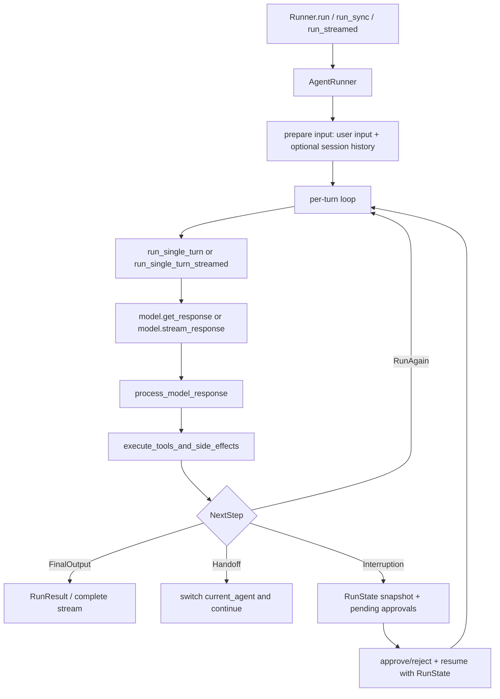
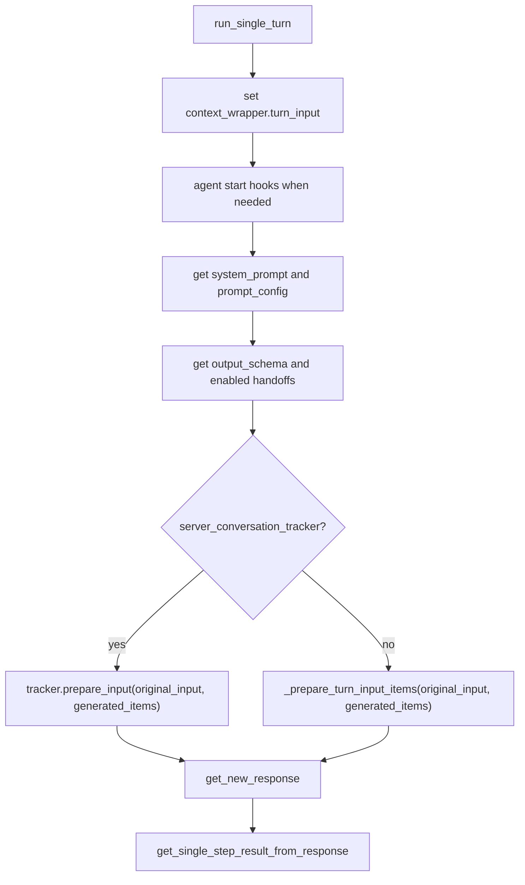
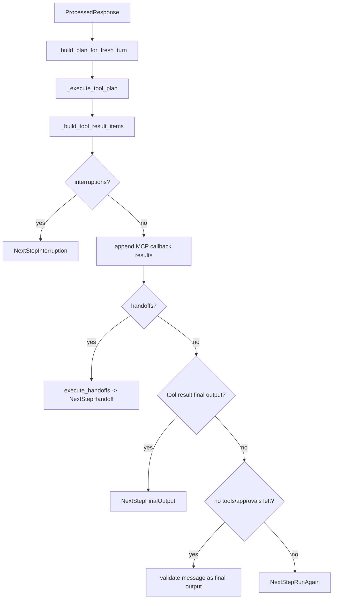
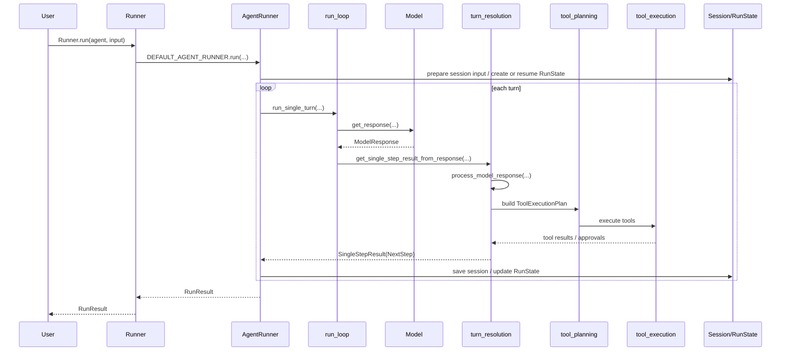
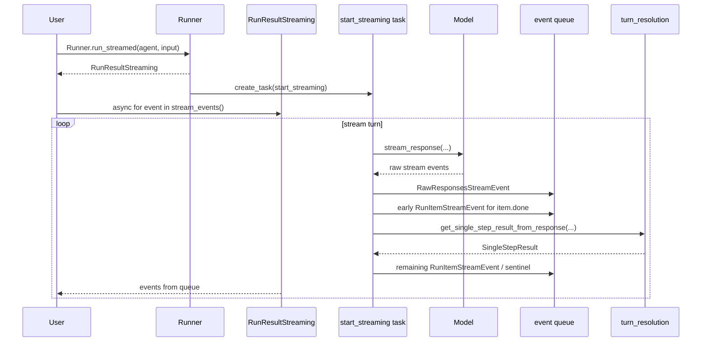

# OpenAI Agents Python 源码架构拆解

本文档面向“读源码、定位改动点、理解运行时协作关系”的维护者视角。它不是用户教程，也不替代 `README.md`、`docs/` 或 API Reference；重点解释 `Runner` 主循环、工具调用、handoff、streaming、`RunState`、session persistence 和 server-managed conversation 如何拼成一次 agent run。

分析方式：

- 先建立项目地图，再进入局部源码。
- 只做源码与文档分析；未修改业务代码。
- 关键结构优先基于 CodeGraph 索引，再用源码行段核对。

## 一句话结论

这个仓库的核心架构是一个“模型单轮调用 + 响应解析 + 本地副作用执行 + 下一步状态机”的循环：

核心源码位置：

- `src/agents/run.py`: public runner facade 与 `AgentRunner` 主编排。
- `src/agents/run_internal/run_loop.py`: 单轮模型调用、streaming 后台循环、输入拼接、重试。
- `src/agents/run_internal/turn_resolution.py`: 将模型输出解析成 SDK 的 step 结果，并执行 tools/handoffs/final output/interruption 分流。
- `src/agents/run_internal/tool_planning.py`: 把待执行工具组织为 `ToolExecutionPlan`。
- `src/agents/run_internal/tool_execution.py`: 真正执行 function/computer/custom/shell/apply_patch/local_shell 工具，并处理 approvals、guardrails、hooks。
- `src/agents/run_internal/session_persistence.py`: session history 准备、保存、resume 去重、重试回滚。
- `src/agents/run_internal/oai_conversation.py`: OpenAI server-managed conversation 的 delta tracking。
- `src/agents/run_state.py`: HITL pause/resume 的可序列化快照边界。
- `src/agents/run_internal/run_steps.py`: 内部状态机数据结构，尤其是 `SingleStepResult` 和四类 `NextStep`。

## 阶段 1：项目地图

### 顶层结构

当前仓库是 Python SDK 项目，主要目录职责如下：

| 路径 | 职责 |
| --- | --- |
| `src/agents/` | SDK 主实现。运行时、agent、tool、handoff、memory、model adapter、tracing、realtime、voice、sandbox 都在这里。 |
| `tests/` | 单元与行为测试。测试按 runtime、models、memory、realtime、sandbox、tracing、voice 等领域组织。 |
| `examples/` | 用户示例和 workflow 示例，用于展示 SDK 用法与边界场景。 |
| `docs/` | MkDocs 用户文档与 API Reference。英文源文档在根层和子目录，`docs/ja`、`docs/ko`、`docs/zh` 是翻译文档。 |
| `mkdocs.yml` | 文档导航、mkdocstrings、i18n、API Reference 配置。 |
| `AGENTS.md` | 贡献者指南，已有基础项目结构与维护规则。 |
| `.agents/skills/` | 本仓库给 Codex/agent 使用的项目技能，例如 code change verification、docs sync。 |

规模快照：

- `src/agents`: 约 285 个文件。
- `tests`: 约 261 个文件。
- `examples`: 约 301 个文件。
- `docs`: 约 386 个文件。

### `src/agents` 功能域

| 路径 | 功能域 |
| --- | --- |
| `agent.py` | `Agent` 配置对象，包含 instructions、tools、MCP servers、handoffs、model settings、guardrails、output schema、agent-as-tool。 |
| `run.py` | `Runner` 对外入口和 `AgentRunner` 内部编排。 |
| `run_internal/` | 主循环被拆出去的内部模块。这里是理解 runtime 的首要入口。 |
| `items.py` | SDK 的 `RunItem` 包装层，把 Responses API output/input 转为可追踪、可回放的 SDK item。 |
| `result.py` | `RunResult`、`RunResultStreaming`、stream event 消费与 cancel。 |
| `run_state.py` | 可序列化运行快照，支持中断后恢复。 |
| `run_config.py` | run 级配置，包括 model、tracing、guardrails、input filters、session settings、handoff settings 等。 |
| `tool.py` | 工具抽象和工具类型，包括 function/custom/hosted/computer/shell/apply_patch 相关定义。 |
| `tool_context.py` | 工具执行时看到的上下文。 |
| `tool_guardrails.py` | 工具输入/输出 guardrail。 |
| `handoffs/` | handoff 定义、输入过滤、历史嵌套策略。 |
| `memory/` | session 协议和内置 session 实现。 |
| `models/` | 模型接口和 OpenAI Responses/Chat Completions/third-party provider adapter。 |
| `tracing/` | trace/span provider、processor、span data。 |
| `realtime/` | Realtime agents 独立运行时。和 `Runner` 主循环同属于 SDK，但不是本文主线。 |
| `voice/` | STT -> workflow -> TTS 的 voice pipeline。 |
| `sandbox/` | sandbox agents、manifest、workspace、runtime session 等。 |

### `run_internal` 项目地图

`run_internal` 是主运行时的内部拆分层：

| 文件 | 职责 |
| --- | --- |
| `run_loop.py` | 单轮模型调用、streaming loop、input guardrails、model retry、stream event 生成、turn 状态推进。 |
| `turn_preparation.py` | normalize hooks、解析当前模型、工具、handoffs、output schema，处理 `call_model_input_filter`。 |
| `turn_resolution.py` | 解析模型输出，并把一轮结果落到 final output / handoff / tool execution / run again / interruption。 |
| `run_steps.py` | `ProcessedResponse`、tool run structs、`NextStep*`、`SingleStepResult`。 |
| `tool_planning.py` | 根据 `ProcessedResponse`、approval state、resume state 生成 `ToolExecutionPlan`。 |
| `tool_execution.py` | 执行各种工具类型；function tool 批执行、approval、guardrails、hooks、nested agent-as-tool。 |
| `tool_actions.py` | custom/shell/apply_patch/computer 等工具 action 的封装执行。 |
| `session_persistence.py` | session 输入准备、保存、resume 去重、guardrail trip 持久化、重试回滚。 |
| `oai_conversation.py` | `conversation_id`、`previous_response_id`、`auto_previous_response_id` 的 server-side conversation tracking。 |
| `items.py` | run item 到 model input 的转换、去重、孤儿 tool call 清理、rejection item 构造。 |
| `streaming.py` | 把 `RunItem` 转成 `RunItemStreamEvent` 并放入 stream queue。 |
| `agent_runner_helpers.py` | `AgentRunner.run` 的辅助函数：resume settings、context、trace、interruption result、state update、save gate。 |
| `agent_bindings.py` | public agent 与 execution agent 的绑定，支持 sandbox/prepared agent 等场景。 |
| `tool_use_tracker.py` | 记录某 agent 是否已用过工具，用于 reset `tool_choice` 等行为。 |
| `model_retry.py` | 非流式和流式模型调用重试。 |
| `approvals.py` | approval 相关输出拼接。 |
| `guardrails.py` | input/output guardrail 执行。 |
| `prompt_cache_key.py` | prompt cache key 的生成与 RunState 持久化。 |

阶段发现：

- 已有 `AGENTS.md` 只提供“贡献者级别”的结构说明；缺少“源码运行时协作图”。
- `run.py` 已经按项目规则把大量逻辑下沉到 `run_internal/`，源码架构边界较清楚。
- 要理解 runtime，不应从 `Agent` 数据结构细节开始，而应从 `Runner -> AgentRunner -> run_loop -> turn_resolution` 的状态机链路开始。

## 阶段 2：运行入口与主循环

### Public facade: `Runner`

`Runner` 是用户看到的入口，提供三种运行方式：

- `Runner.run(...)`: async 非流式入口。
- `Runner.run_sync(...)`: 同步包装。
- `Runner.run_streamed(...)`: streaming 入口，立即返回 `RunResultStreaming`，实际运行放入后台任务。

源码依据：

- `Runner.run` 只是把参数转发给 `DEFAULT_AGENT_RUNNER.run`：`src/agents/run.py:193-272`。
- `Runner.run_sync` 转发给 `DEFAULT_AGENT_RUNNER.run_sync`：`src/agents/run.py:274-350`。
- `Runner.run_streamed` 转发给 `DEFAULT_AGENT_RUNNER.run_streamed`：`src/agents/run.py:352-425`。
- `DEFAULT_AGENT_RUNNER = AgentRunner()`：`src/agents/run.py:1861`。

`Runner` docstring 中已经给出最小状态机：

1. 调用 agent。
2. 如果输出 final output，结束。
3. 如果发生 handoff，切换 agent 再跑。
4. 否则执行工具，再重新调用模型。

### Internal orchestrator: `AgentRunner.run`

`AgentRunner.run` 是非流式主循环。它负责：

1. 规范化 `RunConfig`、hooks、error handlers。
2. 判断输入是新 input 还是 `RunState` resume。
3. 解析 session 与 server-managed conversation 设置。
4. 准备初始模型输入。
5. 创建或恢复 `RunState`。
6. 创建 tracing task span / agent span / turn span。
7. 创建 `SandboxRuntime`。
8. 进入 `while True` turn loop。
9. 每轮调用 `run_single_turn`。
10. 根据 `NextStep` 分支保存 session、更新 state、返回 result 或继续循环。

关键源码：

- resume 分支：`src/agents/run.py:453-493`。
- 新 run + session input 准备：`src/agents/run.py:494-532`。
- server conversation tracker 创建：`src/agents/run.py:541-555`。
- session persistence 与 server conversation 互斥：`src/agents/run.py:555` 加上校验函数 `src/agents/run_internal/agent_runner_helpers.py:224-238`。
- 新建 `RunState`：`src/agents/run.py:617-625`。
- 主循环开始：`src/agents/run.py:751-758`。
- turn 计数和 max_turns：`src/agents/run.py:1041-1051`。
- 调用 `run_single_turn`：`src/agents/run.py:1178-1200` 和 `src/agents/run.py:1235-1254`。
- 处理 `NextStepFinalOutput`：`src/agents/run.py:1348-1396`。
- 处理 `NextStepInterruption`：`src/agents/run.py:1397-1453`。
- 处理 `NextStepHandoff`：`src/agents/run.py:1454-1464`。
- 处理 `NextStepRunAgain`：`src/agents/run.py:1465-1475`。

主循环中的两个重要不变量：

- `current_turn` 只在实际模型调用前递增；resume interruption 时不会先消耗一个新 turn。
- `generated_items` 是“下一轮模型输入”的视图；`session_items` 是“完整可观察历史”的视图。handoff filter/nesting 可能让两者不同。

阶段发现：

- `AgentRunner.run` 不是业务逻辑的容器，而是状态和资源生命周期编排器。
- 实际“单轮行为”被拆到 `run_single_turn`，实际“模型输出含义”被拆到 `turn_resolution`。
- session persistence 与 server-managed conversation 是两条互斥路径：本地 session 自己保存历史，server-managed conversation 依赖 OpenAI server state 和 delta tracking。

## 阶段 3：单轮模型调用

### 非流式单轮：`run_single_turn`

`run_single_turn` 做一轮模型调用和响应处理：

源码依据：

- 设置 turn input：`src/agents/run_internal/run_loop.py:1715-1719`。
- agent start hooks：`src/agents/run_internal/run_loop.py:1721-1735`。
- instructions/prompt：`src/agents/run_internal/run_loop.py:1737-1740`。
- output schema 与 handoffs：`src/agents/run_internal/run_loop.py:1742-1743`。
- server-managed input vs 本地 input：`src/agents/run_internal/run_loop.py:1744-1747`。
- 调用模型：`src/agents/run_internal/run_loop.py:1749-1765`。
- 响应解析和 step 分流：`src/agents/run_internal/run_loop.py:1767-1780`。

### 模型调用：`get_new_response`

`get_new_response` 是非流式模型调用包装层：

1. 运行 `call_model_input_filter`。
2. dedupe input items。
3. 解析 model 和 model settings。
4. 如果有 `OpenAIServerConversationTracker`，标记 input 已发送。
5. 触发 LLM start hooks。
6. 调用 `model.get_response(...)`，并用 `get_response_with_retry` 包起来。
7. retry 失败时调用 rewind helper 回滚 session/tracker。
8. 成功后更新 usage，触发 LLM end hooks。

源码依据：

- input filter 与 dedupe：`src/agents/run_internal/run_loop.py:1803-1812`。
- model/model settings/tool_choice reset：`src/agents/run_internal/run_loop.py:1813-1815`。
- server tracker 标记 input：`src/agents/run_internal/run_loop.py:1817-1819`。
- LLM start hooks：`src/agents/run_internal/run_loop.py:1820-1832`。
- conversation identifiers：`src/agents/run_internal/run_loop.py:1834-1846`。
- retry rewind：`src/agents/run_internal/run_loop.py:1861-1865`。
- `model.get_response(...)`：`src/agents/run_internal/run_loop.py:1867-1887`。
- usage 和 LLM end hooks：`src/agents/run_internal/run_loop.py:1894-1905`。

阶段发现：

- `run_single_turn` 只负责“这一轮怎么调用模型”，不直接解释模型输出。
- `get_new_response` 是 hooks、input filter、retry、server conversation、usage 的集中点。
- `call_model_input_filter` 在 server-managed conversation 下特别敏感：tracker 必须只把 filter 后实际发送的 input 标记为 sent。

## 阶段 4：模型输出解析与状态机分流

### 内部状态类型

`src/agents/run_internal/run_steps.py` 定义运行时内部状态：

- `ProcessedResponse`: 一次模型响应解析后的分类结果。
- `SingleStepResult`: 一轮运行的结果，包含 `next_step`。
- `NextStepFinalOutput`: 本轮得到最终输出。
- `NextStepHandoff`: 需要切换到新 agent。
- `NextStepRunAgain`: 工具已执行，需要把结果发回模型继续。
- `NextStepInterruption`: 需要用户批准/拒绝工具调用后再 resume。

源码依据：

- `ProcessedResponse`: `src/agents/run_internal/run_steps.py:108-140`。
- 四类 `NextStep`: `src/agents/run_internal/run_steps.py:143-163`。
- `SingleStepResult`: `src/agents/run_internal/run_steps.py:166-207`。

### `process_model_response`

`process_model_response` 把 Responses API 的 raw output 分类为 SDK 内部 items 和待执行动作：

| 模型输出 | SDK 表示 / 后续动作 |
| --- | --- |
| `ResponseOutputMessage` | `MessageOutputItem`，可能成为 final output。 |
| `ResponseFunctionToolCall` | `ToolCallItem` + `ToolRunFunction`，后续执行 function tool。 |
| handoff function call | `HandoffCallItem` + `ToolRunHandoff`，后续执行 handoff。 |
| `ResponseComputerToolCall` | `ToolCallItem` + `ToolRunComputerAction`。 |
| `ResponseCustomToolCall` | `ToolCallItem` + `ToolRunCustom`。 |
| `shell_call` / `local_shell_call` | shell/local shell run。 |
| `apply_patch_call` | apply patch run。 |
| hosted MCP approval request | `MCPApprovalRequestItem` + approval request。 |
| hosted file/web/code/image/tool_search | 通常是 already-hosted tool activity，加入 items/tracking。 |

源码依据：

- 分类容器初始化：`src/agents/run_internal/turn_resolution.py:1429-1439`。
- handoff/function map：`src/agents/run_internal/turn_resolution.py:1440-1444`。
- shell/apply_patch/tool_search 等特殊 output 处理：`src/agents/run_internal/turn_resolution.py:1477-1616`。
- built-in hosted tool / computer / MCP / custom tool 分支：`src/agents/run_internal/turn_resolution.py:1617-1750`。
- function call 判断 handoff 还是 function tool：`src/agents/run_internal/turn_resolution.py:1788-1844`。
- 返回 `ProcessedResponse`：`src/agents/run_internal/turn_resolution.py:1846-1858`。

### `get_single_step_result_from_response`

这是非流式与流式共享的汇合点：

1. 调用 `process_model_response`。
2. 在 streaming 模式下，先把 handoff call item 推入 event queue。
3. 记录 tool use。
4. 调用 `execute_tools_and_side_effects`。

源码依据：

- 函数入口和参数：`src/agents/run_internal/turn_resolution.py:1861-1877`。
- process response：`src/agents/run_internal/turn_resolution.py:1878-1886`。
- before side effects hook：`src/agents/run_internal/turn_resolution.py:1888-1889`。
- tool use tracker：`src/agents/run_internal/turn_resolution.py:1891`。
- streaming handoff event：`src/agents/run_internal/turn_resolution.py:1893-1898`。
- side effects 分流：`src/agents/run_internal/turn_resolution.py:1900-1911`。

### `execute_tools_and_side_effects`

这是状态机的核心决策点：

源码依据：

- 生成 tool plan：`src/agents/run_internal/turn_resolution.py:569-574`。
- 执行 tool plan：`src/agents/run_internal/turn_resolution.py:581-596`。
- 构建 tool result items：`src/agents/run_internal/turn_resolution.py:597-606`。
- interruption 分支：`src/agents/run_internal/turn_resolution.py:608-632`。
- MCP callbacks：`src/agents/run_internal/turn_resolution.py:634-639`。
- handoff 分支：`src/agents/run_internal/turn_resolution.py:641-653`。
- tool-result-as-final-output：`src/agents/run_internal/turn_resolution.py:655-668`。
- message final output：`src/agents/run_internal/turn_resolution.py:670-706`。
- run again：`src/agents/run_internal/turn_resolution.py:708-716`。

阶段发现：

- 运行时不是直接“模型说什么就返回什么”，而是先把模型输出归类为 `ProcessedResponse`，再通过 `NextStep` 明确推进。
- function tool、handoff、hosted tools、custom/shell/apply_patch/computer 工具被统一放入同一个 step resolution 流程。
- final output 可以来自模型 message，也可以来自 function tool result，具体由 `tool_use_behavior` 控制。

## 阶段 5：工具调用链路

### Tool planning

`tool_planning.py` 的职责是把 `ProcessedResponse` 转为一个可执行计划：

- fresh turn 使用 `_build_plan_for_fresh_turn`。
- resume turn 使用 `_build_plan_for_resume_turn`。
- MCP approvals 被分为 callback-handled 和 manual 两类。
- approval 状态决定某个工具是执行、拒绝，还是进入 pending interruption。
- `_execute_tool_plan` 可以并行执行多类工具。

源码依据：

- `ToolExecutionPlan`: `src/agents/run_internal/tool_planning.py:177-193`。
- fresh plan: `src/agents/run_internal/tool_planning.py:236-263`。
- resume plan: `src/agents/run_internal/tool_planning.py:266-299`。
- approval partition: `src/agents/run_internal/tool_planning.py:196-207`。
- pending interruption collection: `src/agents/run_internal/tool_planning.py:302-331`。
- tool result items construction: `src/agents/run_internal/tool_planning.py:334-355`。
- parallel tool execution: `src/agents/run_internal/tool_planning.py:541-623`。

### Function tool execution

Function tool 是最复杂的本地工具路径：

1. `_FunctionToolBatchExecutor` 为每个 `ToolRunFunction` 创建 asyncio task。
2. 每个 tool run 先建立 tracing span 和 `ToolContext`。
3. 如果 `needs_approval` 为 true，先查 approval state。
4. 无 approval 时执行 tool input guardrails。
5. 调用 `invoke_function_tool`。
6. 执行 tool output guardrails。
7. 触发 tool start/end hooks。
8. 把结果包成 `FunctionToolResult` 和 `ToolCallOutputItem`。
9. 如果 nested agent-as-tool 产生 interruption，则暂不生成 tool output，保留 nested interruption。

源码依据：

- batch executor：`src/agents/run_internal/tool_execution.py:1351-1410`。
- 创建 tool task：`src/agents/run_internal/tool_execution.py:1412-1423`。
- 单个 function tool 执行入口：`src/agents/run_internal/tool_execution.py:1514-1581`。
- approval 检查：`src/agents/run_internal/tool_execution.py:1583-1660`。
- input guardrails + hooks：`src/agents/run_internal/tool_execution.py:1662-1701`。
- 调用工具：`src/agents/run_internal/tool_execution.py:1713-1718`。
- output guardrails + end hooks：`src/agents/run_internal/tool_execution.py:1741-1757`。
- 结果构建与 nested interruptions：`src/agents/run_internal/tool_execution.py:1830-1870`。

### 其他工具类型

其他工具类型使用 action 类串行封装：

- custom tool: `execute_custom_tool_calls`。
- local shell: `execute_local_shell_calls`。
- hosted/local shell: `execute_shell_calls`。
- apply patch: `execute_apply_patch_calls`。
- computer: `execute_computer_actions`。

源码依据：

- custom tool：`src/agents/run_internal/tool_execution.py:1895-1917`。
- local shell：`src/agents/run_internal/tool_execution.py:1920-1942`。
- shell：`src/agents/run_internal/tool_execution.py:1945-1967`。
- apply patch：`src/agents/run_internal/tool_execution.py:1970-1992`。
- computer safety check + action：`src/agents/run_internal/tool_execution.py:1995-2042`。

阶段发现：

- 工具执行分两层：`turn_resolution` 决定“要不要执行”，`tool_planning` 形成计划，`tool_execution` 真正做副作用。
- function tool 是唯一完整支持 batch 并发、approval、tool guardrails、nested agent-as-tool 状态恢复的复杂工具类型。
- `ToolApprovalItem` 本身不发给模型；它代表 run 被中断，等待外部 approve/reject。

## 阶段 6：Handoff 链路

Handoff 在模型层表现为一个 function tool call，但在 SDK 内部被识别为 agent transfer：

1. `get_handoffs` 解析当前 agent 启用的 handoffs。
2. `process_model_response` 如果 function call 名称匹配 handoff tool name，就生成 `HandoffCallItem` 和 `ToolRunHandoff`。
3. `execute_tools_and_side_effects` 优先在工具执行后检查 `processed_response.handoffs`。
4. `execute_handoffs` 调用 handoff 的 `on_invoke_handoff` 得到目标 agent。
5. 追加 `HandoffOutputItem`。
6. 运行 run-level 和 agent-level handoff hooks。
7. 根据 `input_filter` 或 `nest_handoff_history` 调整下一 agent 的输入。
8. 返回 `NextStepHandoff(new_agent)`。
9. 主循环设置 `current_agent = new_agent` 并继续。

源码依据：

- `Agent.handoffs` 字段：`src/agents/agent.py:258-262`。
- `Handoff` 数据结构：`src/agents/handoffs/__init__.py:93-168`。
- handoff input filter 语义：`src/agents/handoffs/__init__.py:126-140`。
- 启用 handoff 获取：`src/agents/run_internal/turn_preparation.py:85-105`。
- function call -> handoff 分类：`src/agents/run_internal/turn_resolution.py:1791-1797`。
- handoff 执行：`src/agents/run_internal/turn_resolution.py:323-509`。
- 非流式主循环切 agent：`src/agents/run.py:1454-1464`。
- streaming 主循环切 agent 并发 `AgentUpdatedStreamEvent`：`src/agents/run_internal/run_loop.py:1085-1102`。

server-managed conversation 下的特殊规则：

- handoff input filter 不支持，会抛 `UserError`。
- nested handoff history 会被禁用，并以 delta-only 输入继续。

源码依据：

- `_resolve_server_managed_handoff_behavior`: `src/agents/run_internal/turn_resolution.py:291-321`。

阶段发现：

- Handoff 不是单独的主循环，而是 `NextStepHandoff` 让同一个 loop 切换 `current_agent`。
- `session_step_items` 是 handoff 关键细节：可以让下一 agent 的模型输入被过滤，同时 session history 保存完整 unfiltered items。

## 阶段 7：Streaming 链路

### Streaming 入口

`AgentRunner.run_streamed` 不直接跑完任务，而是：

1. 创建或恢复 `RunState`。
2. 创建 `RunResultStreaming`。
3. 把已有 state 填到 streaming result。
4. 创建后台 task 调用 `start_streaming(...)`。
5. 立即返回 `RunResultStreaming` 给用户。

源码依据：

- `RunState` 创建/恢复：`src/agents/run.py:1648-1727`。
- trace 创建：`src/agents/run.py:1729-1751`。
- `RunResultStreaming` 构造：`src/agents/run.py:1775-1813`。
- 后台 task：`src/agents/run.py:1836-1855`。

### `start_streaming`

`start_streaming` 是 streaming 版主循环。它和非流式主循环保持行为对齐，但多了 event queue：

- 创建 server conversation tracker。
- 确保 `RunState` 和 streaming result 同步。
- 准备 session input。
- 首次发出 `AgentUpdatedStreamEvent`。
- 每轮调用 `run_single_turn_streamed`。
- 根据 `NextStep` 更新 streaming result、保存 session、发 queue sentinel。
- finally 中同步 conversation tracking，finish trace/span，dispose computers。

源码依据：

- tracker 创建：`src/agents/run_internal/run_loop.py:490-502`。
- state/result 同步：`src/agents/run_internal/run_loop.py:519-547`。
- session input 准备：`src/agents/run_internal/run_loop.py:586-610`。
- 初始 agent update event：`src/agents/run_internal/run_loop.py:584`。
- turn loop：`src/agents/run_internal/run_loop.py:665-676`。
- 调用 streamed turn：`src/agents/run_internal/run_loop.py:1014-1033`。
- turn result 写回 streaming result：`src/agents/run_internal/run_loop.py:1055-1074`。
- handoff/final/interruption/run-again 分支：`src/agents/run_internal/run_loop.py:1085-1158`。
- finally 清理：`src/agents/run_internal/run_loop.py:1197-1233`。

### `run_single_turn_streamed`

流式单轮与非流式单轮共享大部分语义，但多处理 raw stream event：

1. 准备工具 lookup map，用于 streaming tool description。
2. 准备 input，并运行 `call_model_input_filter`。
3. 发 LLM start hooks。
4. 通过 `model.stream_response(...)` 获取 raw Responses stream。
5. 每个 raw event 先包装成 `RawResponsesStreamEvent` 入队。
6. 对 item done event 生成 SDK-level `RunItemStreamEvent`，例如 tool_called、reasoning_item_created。
7. terminal response 组装为 `ModelResponse`。
8. 调用共享的 `get_single_step_result_from_response`。
9. 过滤已提前 streaming 的 items，避免重复发。
10. 通过 `stream_step_result_to_queue` 发剩余 step items。

源码依据：

- 函数入口：`src/agents/run_internal/run_loop.py:1236-1252`。
- tool map：`src/agents/run_internal/run_loop.py:1273-1290`。
- input/filter：`src/agents/run_internal/run_loop.py:1344-1385`。
- stream retry 与 `model.stream_response`: `src/agents/run_internal/run_loop.py:1453-1474`。
- raw event 入队：`src/agents/run_internal/run_loop.py:1476-1477`。
- terminal response 组装：`src/agents/run_internal/run_loop.py:1479-1515`。
- tool/reasoning item done event：`src/agents/run_internal/run_loop.py:1517-1613`。
- 共享 step resolution：`src/agents/run_internal/run_loop.py:1635-1650`。
- 过滤已 streaming 的 items：`src/agents/run_internal/run_loop.py:1652-1688`。
- step result 入队：`src/agents/run_internal/run_loop.py:1690-1692`。

### Stream event 转换

`run_internal/streaming.py` 将 `RunItem` 转成 `RunItemStreamEvent`：

| RunItem | Event name |
| --- | --- |
| `MessageOutputItem` | `message_output_created` |
| `HandoffCallItem` | `handoff_requested` |
| `HandoffOutputItem` | `handoff_occured` |
| `ToolCallItem` | `tool_called` |
| `ToolCallOutputItem` | `tool_output` |
| `ReasoningItem` | `reasoning_item_created` |
| `MCPApprovalRequestItem` | `mcp_approval_requested` |
| `MCPApprovalResponseItem` | `mcp_approval_response` |

源码依据：

- event mapping：`src/agents/run_internal/streaming.py:27-62`。
- step result 入队：`src/agents/run_internal/streaming.py:65-70`。

阶段发现：

- Streaming 不是另一套业务规则；它是同一个 `SingleStepResult` 状态机，只是模型 token/item 到达时提前发 event。
- streaming 要特别注意“已提前发出的 tool call / reasoning item / tool search item”去重，否则最终 step result 会重复发。
- `RunResultStreaming.stream_events()` 负责用户侧消费和后台 task cleanup，`start_streaming` 负责生产事件。

## 阶段 8：RunState 与 interruption/resume

### RunState 存什么

`RunState` 是 HITL pause/resume 的 durable boundary。它保存：

- 当前 turn。
- 当前 agent 和 starting agent。
- 原始 input。
- 模型 responses。
- generated items：用于恢复后构造下一轮模型输入。
- session items：完整可观察历史。
- max turns。
- server-managed conversation identifiers。
- prompt cache key。
- reasoning item ID 策略。
- input/output/tool guardrail results。
- 当前 step，主要是 `NextStepInterruption`。
- 上一次 `ProcessedResponse`，用于 interruption resume。
- 当前 turn 已持久化 item 数，避免重复保存。
- tool use tracker snapshot。
- trace state。
- nested agent-as-tool pending state。
- sandbox resume payload。
- schema version。

源码依据：

- schema policy 与版本：`src/agents/run_state.py:124-148`。
- class docstring：`src/agents/run_state.py:182-196`。
- 核心字段：`src/agents/run_state.py:198-277`。
- `approve` / `reject`: `src/agents/run_state.py:330-355`。
- `to_json`: `src/agents/run_state.py:655-772`。
- `from_json`: `src/agents/run_state.py:1061-1094`。
- schema 校验与还原入口：`src/agents/run_state.py:2357-2382`。
- generated/session/current_step 反序列化：`src/agents/run_state.py:2486-2556`。

### interruption 如何产生

工具需要 approval 且当前没有 approval decision 时，会形成 `ToolApprovalItem`：

- fresh turn：function tool approval 在 `_maybe_execute_tool_approval` 中生成 `ToolApprovalItem`，然后 `execute_tools_and_side_effects` 收集为 `NextStepInterruption`。
- MCP manual approvals 也会进入 pending interruption。
- nested agent-as-tool 如果内部 run 有 interruption，也会冒泡到父 tool result。

源码依据：

- function tool approval item：`src/agents/run_internal/tool_execution.py:1583-1624`。
- collect interruptions：`src/agents/run_internal/tool_planning.py:302-331`。
- fresh turn 返回 `NextStepInterruption`: `src/agents/run_internal/turn_resolution.py:608-632`。
- `AgentRunner.run` 保存 interruption state：`src/agents/run.py:1417-1430`。
- `build_interruption_result`: `src/agents/run_internal/agent_runner_helpers.py:375-426`。

### resume 如何继续

用户拿到 `RunResult` 后可以把其中 state 序列化，之后 approve/reject，再把 `RunState` 作为 input 传回 `Runner.run` 或 `Runner.run_streamed`。

恢复路径：

1. `AgentRunner.run` 发现 input 是 `RunState`。
2. 恢复 conversation settings、context、max_turns、current_agent、generated_items、model_responses。
3. 如果当前 step 是 `NextStepInterruption`，调用 `resolve_interrupted_turn`。
4. `resolve_interrupted_turn` 根据 approval state 重建/过滤待执行 tool runs。
5. 已有 tool output 不重复执行。
6. 如果仍有 pending approval，继续返回 `NextStepInterruption`。
7. 否则继续 handoff/final/run-again 状态机。

源码依据：

- resume 检测：`src/agents/run.py:453-465`。
- resume context：`src/agents/run.py:486-493`。
- restore generated/session/model state：`src/agents/run.py:599-608`。
- interruption resume 调用：`src/agents/run.py:824-844`。
- resume 后更新 state：`src/agents/run.py:852-861`。
- `resolve_interrupted_turn` 入口：`src/agents/run_internal/turn_resolution.py:719-733`。
- pending approval 从 state 读取：`src/agents/run_internal/turn_resolution.py:744-755`。
- function tool resume selection：`src/agents/run_internal/turn_resolution.py:1150-1170`。
- shell/apply_patch/custom approval resume selection：`src/agents/run_internal/turn_resolution.py:1194-1231`。
- resume plan 执行：`src/agents/run_internal/turn_resolution.py:1233-1262`。
- 仍有 pending interruption：`src/agents/run_internal/turn_resolution.py:1297-1310`。
- pending handoff：`src/agents/run_internal/turn_resolution.py:1365-1392`。
- resume 后 final/run-again：`src/agents/run_internal/turn_resolution.py:1394-1417`。

阶段发现：

- `RunState` 不是简单的 transcript dump；它保存的是“足以恢复状态机”的结构化快照。
- `generated_items` 与 `last_processed_response` 有 merge marker，防止 serialization 时漏掉或重复加入刚处理过的 items。
- resume 的核心风险是重复执行工具；代码通过 output index、persisted count、approval state、tool call IDs 和 nested agent tool cache 来避免。

## 阶段 9：Session persistence 与 server-managed conversation

### Session persistence

session 是本地会话历史接口，协议定义在 `src/agents/memory/session.py`：

- `get_items(limit=None)`
- `add_items(items)`
- `pop_item()`
- `clear_session()`

源码依据：

- `Session` protocol：`src/agents/memory/session.py:13-54`。
- compaction-aware session protocol：`src/agents/memory/session.py:131-150`。

session persistence 的关键流程：

1. run 开始时，`prepare_input_with_session` 从 session 拉历史。
2. 把历史和新 input 合并。
3. 如果有 `session_input_callback`，让用户自定义合并/过滤。
4. 规范化 input，移除 orphan tool calls，dedupe。
5. 返回“发给模型的 prepared input”和“应该追加到 session 的 new input subset”。
6. turn 完成后，`save_result_to_session` 把 original input 和 new run items 转为 input items 保存。
7. 保存时用 `_current_turn_persisted_item_count` 防止 streaming/resume 重复写。
8. 如果 session 支持 compaction，则根据 response_id 和本地 tool output 情况触发或延迟 compaction。

源码依据：

- `prepare_input_with_session`：`src/agents/run_internal/session_persistence.py:54-171`。
- guardrail trip 保存 input：`src/agents/run_internal/session_persistence.py:174-196`。
- turn item 选择：`src/agents/run_internal/session_persistence.py:199-213`。
- run state resume 后更新：`src/agents/run_internal/session_persistence.py:216-229`。
- `save_result_to_session`: `src/agents/run_internal/session_persistence.py:231-365`。
- resumed turn save：`src/agents/run_internal/session_persistence.py:368-389`。
- retry rewind：`src/agents/run_internal/session_persistence.py:392-430`。

### Server-managed conversation

server-managed conversation 是另一种历史管理策略。触发条件：

- `conversation_id` 不为空。
- 或 `previous_response_id` 不为空。
- 或 `auto_previous_response_id=True`。

这种模式下 SDK 不把完整历史存在 local session 中，而是通过 `OpenAIServerConversationTracker` 只发送 server 还没见过的 delta。

源码依据：

- tracker class docstring：`src/agents/run_internal/oai_conversation.py:99-110`。
- tracker fields：`src/agents/run_internal/oai_conversation.py:112-138`。
- resume hydration：`src/agents/run_internal/oai_conversation.py:148-307`。
- track server outputs：`src/agents/run_internal/oai_conversation.py:309-351`。
- mark input sent：`src/agents/run_internal/oai_conversation.py:353-386`。
- retry rewind input：`src/agents/run_internal/oai_conversation.py:388-410`。
- prepare delta input：`src/agents/run_internal/oai_conversation.py:411-504`。

### 两者互斥

local session persistence 与 server-managed conversation 互斥，因为两者都想管理历史：

- local session: SDK 把历史读出并发送给模型，再把新 items 存回 session。
- server-managed conversation: SDK 只发 delta，server 保存和拼接历史。

源码依据：

- `validate_session_conversation_settings`：`src/agents/run_internal/agent_runner_helpers.py:224-238`。
- 非流式中 `session_persistence_enabled = session is not None and server_conversation_tracker is None`：`src/agents/run.py:555`。
- streaming 中 `_should_persist_stream_items` 遇到 server tracker 直接返回 false：`src/agents/run_internal/run_loop.py:263-272`。

阶段发现：

- session persistence 关注“本地历史完整性、去重、compaction”。
- server-managed conversation 关注“只发送 delta、避免 replay server 已确认内容”。
- 它们不是可叠加功能，而是两种互斥的 conversation state backend。

## 阶段 10：关键协作关系速查

### 非流式 run 的主链路

### Streaming run 的主链路

### 数据视图关系

| 数据 | 含义 | 主要维护方 |
| --- | --- | --- |
| `original_input` | 当前 run/turn 的用户输入或 handoff 过滤后的 input history。 | `AgentRunner`, `execute_handoffs` |
| `generated_items` | 下一轮模型输入所需的 prior run items，可能被 handoff filter 过滤。 | `AgentRunner`, `RunState` |
| `session_items` / `new_items` | 完整观测历史和 session 保存用 items。 | `AgentRunner`, `session_persistence` |
| `model_responses` / `raw_responses` | 模型原始响应序列。 | `AgentRunner`, `RunResult` |
| `ProcessedResponse` | 某个 model response 被解析出的待执行动作。 | `turn_resolution` |
| `SingleStepResult` | 一个 turn 的统一输出，携带下一步状态。 | `turn_resolution` |
| `RunState` | 可序列化 resume snapshot。 | `run_state.py`, `AgentRunner` |
| `OpenAIServerConversationTracker` | server-managed conversation delta/dedupe state。 | `oai_conversation.py`, `run_loop.py` |

## 修改定位指南

| 想改的行为 | 优先看哪里 |
| --- | --- |
| 新增一种模型输出 item 类型 | `items.py`, `run_internal/run_steps.py`, `turn_resolution.py`, `tool_planning.py`, `tool_execution.py`, `run_internal/items.py`, `stream_events.py`, `run_state.py`, `session_persistence.py` |
| 调整主循环 turn 行为 | `run.py`, `run_internal/run_loop.py`, `run_internal/agent_runner_helpers.py` |
| 调整 function tool 执行、approval、guardrail | `run_internal/tool_execution.py`, `run_internal/tool_planning.py`, `tool_guardrails.py` |
| 调整 handoff 输入过滤或历史嵌套 | `handoffs/`, `run_internal/turn_resolution.py`, `run_config.py` |
| 调整 streaming event | `run_internal/run_loop.py`, `run_internal/streaming.py`, `stream_events.py`, `result.py` |
| 调整 pause/resume schema | `run_state.py`，同时更新 schema version 与 tests |
| 调整 session 保存/回放/去重 | `run_internal/session_persistence.py`, `run_internal/items.py`, `memory/` |
| 调整 server-managed conversation | `run_internal/oai_conversation.py`, `run_internal/run_loop.py`, `run.py` |
| 调整 model provider 调用 | `models/interface.py`, `models/openai_responses.py`, `models/openai_chatcompletions.py`, `run_internal/turn_preparation.py` |

## 推荐阅读顺序

第一次读源码建议按这个顺序：

1. `src/agents/run_internal/run_steps.py`  
   先理解状态机的数据结构。

2. `src/agents/run.py` 的 `AgentRunner.run`  
   读主循环，不要陷入 tool 细节。

3. `src/agents/run_internal/run_loop.py` 的 `run_single_turn` 和 `get_new_response`  
   理解一次模型调用如何被准备、过滤、重试、hook。

4. `src/agents/run_internal/turn_resolution.py` 的 `process_model_response` 和 `execute_tools_and_side_effects`  
   理解模型输出如何变成状态机分支。

5. `src/agents/run_internal/tool_planning.py` 与 `tool_execution.py`  
   理解工具、approval、guardrails、nested agent-as-tool。

6. `src/agents/run_internal/run_loop.py` 的 `start_streaming` 和 `run_single_turn_streamed`  
   对比 streaming 与 non-streaming 的行为一致性。

7. `src/agents/run_state.py` 与 `session_persistence.py`  
   理解中断、恢复、session 去重、schema 兼容。

8. `src/agents/run_internal/oai_conversation.py`  
   理解 server-managed conversation 为什么必须只发 delta。

## 当前文档覆盖边界

本文档覆盖的是主 runtime 架构，不展开以下领域的全部内部细节：

- Realtime agents: `src/agents/realtime/` 有独立 session/transport/event 模型。
- Voice pipeline: `src/agents/voice/` 主要是 STT/workflow/TTS pipeline。
- Sandbox agents: 本文只在主循环中提到 `SandboxRuntime`，没有展开 manifest/materialization/session lifecycle。
- Model adapters: 本文只解释 runtime 如何调用 `Model` interface，不展开 Responses/Chat Completions converter 的 payload 细节。
- Tracing provider: 本文只解释 run/task/turn/tool span 的放置点，不展开 processor/exporter。

如果后续继续深化，建议新增独立文档：

- `SOURCE_ARCHITECTURE_MODELS.md`: OpenAI Responses / Chat Completions adapter 与 converter。
- `SOURCE_ARCHITECTURE_SANDBOX.md`: sandbox agent lifecycle、manifest、runtime session。
- `SOURCE_ARCHITECTURE_REALTIME.md`: realtime runner/session/events/transport。
- `SOURCE_ARCHITECTURE_TRACE.md`: trace/span processor 与 usage accounting。

## 总结

这个项目的源码架构可以理解为四层：

1. **配置层**：`Agent`、`RunConfig`、tools、handoffs、sessions、model settings。
2. **编排层**：`Runner` / `AgentRunner` 管理 lifecycle、turn loop、trace、sandbox、session、resume。
3. **单轮执行层**：`run_loop` 准备 input 并调用 model，`turn_resolution` 解析响应并决定下一步。
4. **副作用与持久化层**：`tool_execution` 执行本地工具，`session_persistence` 和 `RunState` 支持保存、恢复、去重，`oai_conversation` 支持 server-side conversation delta。

理解主线时，最重要的不是某个工具类，而是这个不变量：

> 每次模型响应都会被解析为 `ProcessedResponse`，再落成一个 `SingleStepResult`，主循环只根据 `NextStepFinalOutput`、`NextStepHandoff`、`NextStepRunAgain`、`NextStepInterruption` 四类结果推进。

